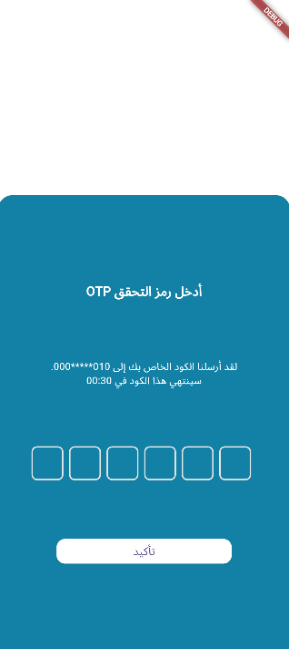

Great! Based on your description and the repo link `https://github.com/Hebabo/ITI_Task4.1`, here’s a clean and informative `README.md` you can copy into your project:

---

## 📱 ITI Task 4.1 – Flutter Layout & Widget Practice

This project is part of the **ITI Flutter track** and is focused on **practicing layout and widget concepts** in Flutter. It showcases a multi-screen structure with basic user interaction, including an OTP input interface using the `flutter_otp_text_field` package.

---

### ✨ Features

* Custom layout using `Container`, `Column`, `SizedBox`, and other core widgets
* OTP verification screen with responsive design
* Use of package: [`flutter_otp_text_field`](https://pub.dev/packages/flutter_otp_text_field)
* Simple navigation between form and OTP verification without reloading the whole screen

---

### 📸 Screenshots

| splashScreen                           | Login Screen                           | OTP Screen                         | 
| -------------------------------------- | -------------------------------------- | ---------------------------------- | 
|  |  |  |

> ℹ️ To enable these images, create a folder at `assets/screenshots/` and name your screenshot files:
> `login.png`, `otp.png`, `confirmed.png`.
> Don’t forget to declare the `assets/` path in your `pubspec.yaml`.

---

### 🛠️ Tech Stack

* **Flutter SDK**
* `flutter_otp_text_field: ^1.5.1+1`
* Dart programming language

---

### 🚀 Getting Started

Follow these steps to run the project locally:

```bash
# Clone the repo
git clone https://github.com/Hebabo/ITI_Task4.1
cd ITI_Task4.1

# Install dependencies
flutter pub get

# Run the app
flutter run
```

Make sure you have a working Flutter environment. You can verify with:

```bash
flutter doctor
```

---

### 📂 Project Structure (Basic Overview)

```
lib/
├── main.dart
├── views/
│   ├── login_screen.dart
│   ├── otp_screen.dart
├── widgets/
│   ├── app_colors.dart
│   ├── pin_code_fields.dart
assets/
└── screenshots/
```

---

### 📌 Notes

* Designed for learning and layout prototyping only.
* No backend integration – OTP entry is UI-only.
* Modify `LoginScreenConent` to add your own form fields or logic.

---

### 📧 Contact

For any questions, feel free to reach out via [GitHub Issues](https://github.com/Hebabo/ITI_Task4.1/issues).

